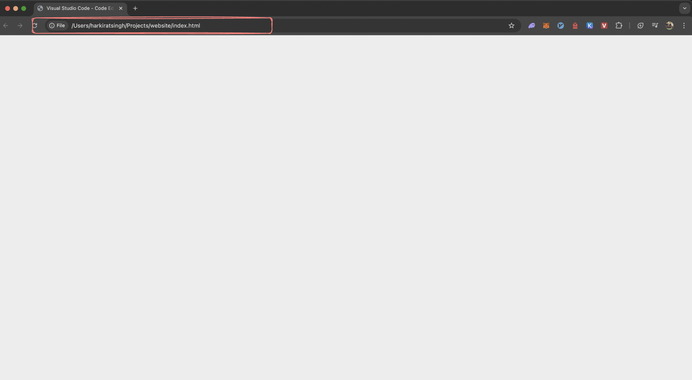
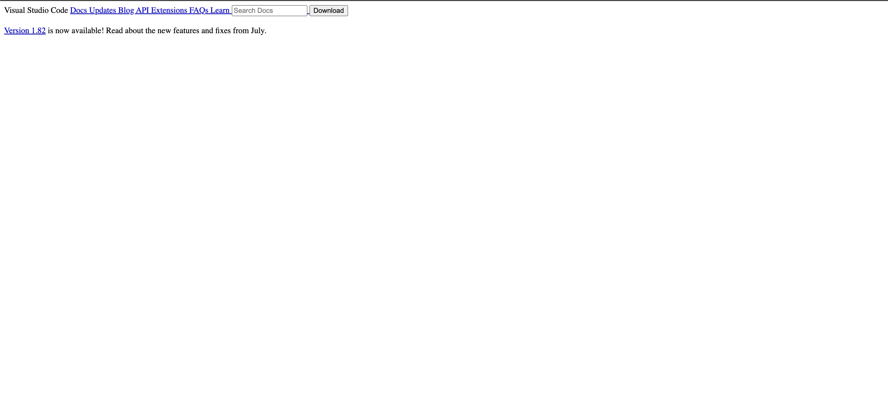

# HTML

HTML stands for hyper text markup language. It is the foundation of building `unstyled` websites.

### Step 1 - Creating a simple HTML file locally

1. Create a folder on your machine called `website`
2. Add a `index.html` file inside it
3. Write the following code in it - 

```rust
<html>
	<title>
		Visual Studio Code - Code Editor
	</title>
</html>
```

Now open this in your browser



### Step 2 - Tags

1. div, span
2. head
3. body
4. h1, h2, h3, h4, h5, h6
5. b, i, u
6. a
7. img
8. input
9. button
10. br

### Step 3 - Building a basic HTML page

```rust
<html>
	<title>
		Visual Studio Code - Code Editor
	</title>
</html>
<body>
	<div>
		<span>Visual Studio Code</span>
		<a href="/">Docs</span> 
		<a href="/">Updates</span> 
		<a href="/">Blog</span> 
		<a href="/">API</span> 
		<a href="/">Extensions</span> 
		<a href="/">FAQs</span>
		<a href="/">Learn</span>
		
		<input type="text" placeholder="Search Docs">
		<button>Download</button>
	</div>
	<br/>

	<div>
		<a href="/">Version 1.82</a> is now available! Read about the new features and fixes from July.
	</div>

	<br/>
</body>
```

